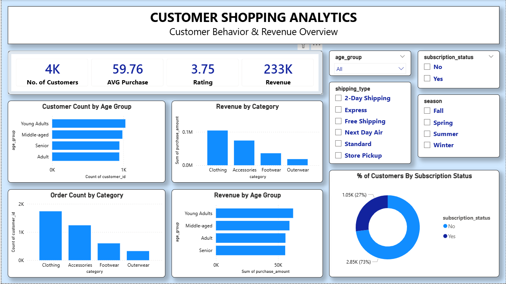

# 📊 Customer Shopping Analytics

## Project Overview

An end-to-end analysis of customer shopping behavior: data cleaning and EDA in Python, business-question analysis in SQL, and an interactive Power BI dashboard covering revenue, product performance, customer segments, and subscription behavior.

**Data note:** this dataset is a customer-level snapshot (3,900 customers, one row each) rather than a per-transaction log — there's no date/timestamp field, so the analysis covers revenue *by category, age group, and season*, not revenue *over time*.

---

## Business Objectives

* Which product categories contribute the most to revenue and order volume?
* Which customer segments (age group, subscription status) generate the highest revenue?
* How does subscription status relate to spending and repeat-purchase behavior?
* How do shipping preferences and discount usage vary across products?
* What business opportunities can be identified from the analysis?

---

## Tools & Technologies

Python (Pandas, NumPy, Matplotlib, Seaborn) · SQL (MySQL) · Power BI (DAX) · Exploratory Data Analysis · Data Cleaning · Data Visualization

---

## Project Workflow

### 1. Data Preparation — Python

- Loaded the raw dataset (3,900 rows, 18 columns) and checked types, nulls, and value ranges
- Imputed 37 missing `Review Rating` values using the **category median** (preserves category-level rating differences, unlike a single global median)
- Verified `Age` (18–70), `Purchase Amount` (20–100), and `Review Rating` (1–5 range) against explicit assertions rather than assuming the ranges were clean
- Checked for and confirmed 0 duplicate rows and 0 duplicate `Customer ID`s
- Standardized column names to lowercase/snake_case
- Created `age_group` via a quartile split of `Age` — **Young Adults: 18–31, Adult: 31–44, Middle-aged: 44–57, Senior: 57–70** (statistical quartile bins based on this dataset's distribution, not standard demographic brackets)
- Created `purchase_frequency_days`, mapping each purchase-frequency label to an approximate day count, validated against the dataset's actual category labels before mapping
- Verified `discount_applied` and `promo_code_used` were 100% identical before dropping the redundant column
- Exported the cleaned dataset to `cleaned_customer_shopping.csv` — the single source of truth used by both the SQL and Power BI steps below

### 2. Business Analysis — SQL

- Loaded `cleaned_customer_shopping.csv` into MySQL via the Table Data Import Wizard
- Ran validation queries first (row count, null checks, duplicate check) before any analysis
- Answered 10 business questions covering revenue by gender, discount behavior, product ratings, shipping type comparisons, subscription spend, and category rankings using window functions and CTEs
- **Customer segmentation assumption:** since this dataset's minimum `previous_purchases` value is 1 (no customer has 0 recorded purchases), *New* = 1 previous purchase, *Returning* = 2–10, *Loyal* = 11+

### 3. Visualization — Power BI

- Interactive dashboard built directly on `cleaned_customer_shopping.csv`
- Filterable by Age Group, Shipping Type, Subscription Status, and Season

---

## Key Insights

**Revenue & customers:** ~3,900 customers generated $233,081 in total purchase value, averaging $59.76 per customer, with an average review rating of 3.75/5.

**Category performance:** Clothing leads on both revenue ($104,264) and order volume (1,737 orders), followed by Accessories ($74,200 / 1,240 orders). Footwear and Outerwear trail well behind both.

**Age groups:** revenue is fairly evenly split across all four age groups ($55,763–$62,143 each) — Young Adults generate the most ($62,143) and are also the largest group by count (1,028), but the gap between the highest and lowest-earning age group is under 11%, meaning age group is a much weaker revenue driver here than category is.

**Subscriptions:** 27% of customers are subscribers, 73% are not. Notably, customers with more than 5 previous purchases subscribe at almost exactly the same rate (27.6%) as the customer base overall — being a repeat buyer doesn't appear to predict subscription likelihood in this dataset, which is worth knowing before designing a "target loyal customers for subscription upsell" campaign.

**Customer segments:** the large majority of customers (3,116 of 3,900) fall into the *Loyal* segment (11+ previous purchases) by this dataset's definition — only 83 are *New* (1 previous purchase).

---

## Business Recommendations

**1. Lead with category, not demographics, for merchandising decisions.** Clothing and Accessories together account for the large majority of revenue and order volume — promotional and cross-sell efforts will likely have more impact focused here than segmented by age group, given how evenly revenue is spread across ages.

**2. Don't assume repeat buyers are subscription-ready.** Since subscription rate doesn't rise with purchase frequency in this data, a subscription campaign targeted purely at frequent buyers isn't obviously better-positioned than a broader campaign — worth testing messaging/incentive differences instead of just targeting by purchase count.

**3. Investigate the "New" customer gap.** Only 83 of 3,900 customers are in their first recorded purchase — worth checking whether this reflects genuinely low new-customer acquisition, or a dataset collection artifact (e.g., survey respondents skewed toward existing customers).

---

## Repository Contents

| File | Description |
|---|---|
| `Customer_Shopping_Analytics.ipynb` | Python data cleaning and validation |
| `data/cleaned_customer_shopping.csv` | Cleaned dataset — shared source for SQL and Power BI |
| `Customer_Shopping_Analysis.sql` | SQL validation & business analysis queries |
| `Customer_Shopping_Dashboard.pbix` | Interactive Power BI dashboard |
| `dashboard.png` | Dashboard preview |
| `README.md` | Project documentation |

---

## How to Reproduce

1. Clone or download this repository
2. Open `Customer_Shopping_Analytics.ipynb` and run all cells top to bottom to regenerate `cleaned_customer_shopping.csv`
3. In MySQL Workbench: run the setup portion of `Customer_Shopping_Analysis.sql` (`CREATE DATABASE` → `CREATE TABLE`), then use the **Table Data Import Wizard** (right-click the `customer` table → Table Data Import Wizard) to load `cleaned_customer_shopping.csv` into it — make sure to disable Workbench's default 1000-row result-grid limit if exporting query results elsewhere
4. Run the validation and business queries in `Customer_Shopping_Analysis.sql`
5. Open `Customer_Shopping_Dashboard.pbix` in Power BI Desktop. If the data source shows an error on open, go to **Transform Data → Applied Steps → Source (gear icon)** and repoint it to your local copy of `cleaned_customer_shopping.csv`, then **Close & Apply**

---

## Conclusion

This project covers the full analytics pipeline — Python cleaning and validation, SQL business analysis, and Power BI visualization — built on a single shared cleaned dataset rather than divergent exports at each stage, so every number in the dashboard traces back to the same validated source.
